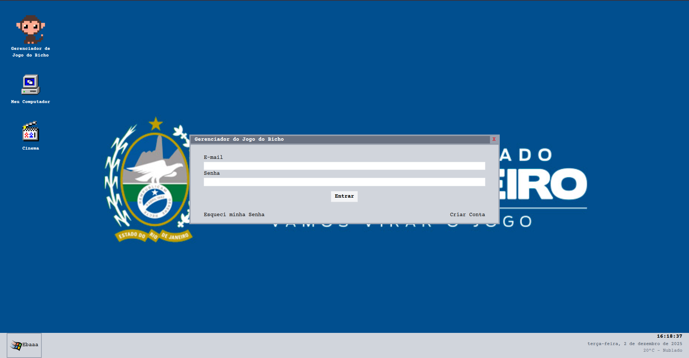
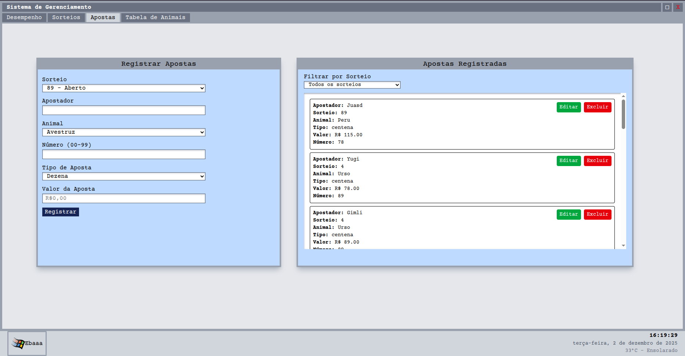
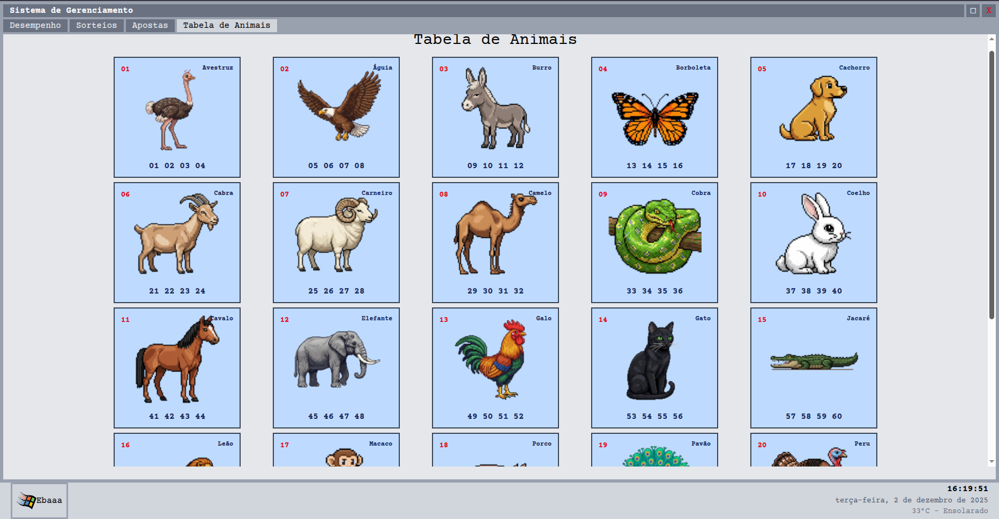

# Jogo do Bixo

Este projeto é uma atividade de projeto final para a disciplina de Programação Web. Este software é uma simulação completa do "Jogo do Bicho" criada exclusivamente para fins acadêmicos, incluindo sistema de apostas, sorteios automáticos, interface administrativa e simulação com bots.

## Screenshots

Aqui estão algumas capturas de tela das principais partes da aplicação:

### Tela de Login


### Dashboard de Apostas


### Tabela de Animais


### Dashboard de Sorteios


## Funcionalidades Principais

### 🎯 Sistema de Apostas [NÃO IMPLEMENTADO]

- **Tipos de Aposta**: GRUPO (18x), DEZENA (60x), CENTENA (300x), MILHAR (4000x)
- **Validação em Tempo Real**: Verificação de saldo e regras de negócio
- **Histórico Completo**: Todas as apostas com status (PENDING, WON, LOST)
- **Reembolso**: Possibilidade de cancelar apostas pendentes

### 🎲 Sorteios Automáticos [NÃO IMPLEMENTADO]

- **Baseados em Clima**: Números gerados usando dados climáticos reais de locais aleatórios
- **Cron Jobs**: Sorteios automáticos a cada 5 minutos
- **Execução Manual**: Interface administrativa para sorteios sob demanda
- **Histórico**: Todos os sorteios passados com dados climáticos

### 👥 Sistema de Usuários

- **Registro e Login**: Autenticação JWT completa
- **Perfis**: Jogadores e Administradores
- **Saldo Inicial**: R$ 100,00 para novos usuários
- **Avatar Automático**: Geração de avatares via API externa

### 🤖 Simulação com Bots [NÃO IMPLEMENTADO]

- **Bots Inteligentes**: 20 bots simulando jogadores reais
- **Apostas Aleatórias**: Diferentes tipos e valores
- **Recarga Automática**: Bots recarregam saldo quando necessário
- **Atividade Contínua**: Simulação 24/7 para manter o sistema ativo

### 📊 Interface Administrativa

- **Dashboard Completo**: Visão geral do sistema
- **Gerenciamento de Usuários**: Lista, filtros e permissões
- **Controle de Apostas**: Visualização e filtros avançados
- **Relatórios Financeiros**: Transações, saldos e auditoria
- **Controle de Sorteios**: Criar, editar e executar sorteios

### 📈 Sistema de Performance

- **Estatísticas Mensais**: Volume de apostas e valores
- **Gráficos Diários**: Performance por dia do mês
- **Métricas em Tempo Real**: Apostas abertas por usuário
- **Relatórios Detalhados**: Análise completa do negócio

### 💰 Sistema Financeiro [NÃO IMPLEMENTADO]

- **Transações Auditadas**: Histórico completo de todas as movimentações
- **Saldo em Centavos**: Precisão decimal perfeita
- **Tipos de Transação**: DEPÓSITO, SAQUE, APOSTA, PRÊMIO, REEMBOLSO
- **Balanço Automático**: Atualização automática após cada operação

### 🔐 Segurança e Permissões

- **JWT Authentication**: Tokens seguros com expiração
- **Role-Based Access**: Controle granular de permissões
- **Validação Zod**: Schemas robustos para todas as entradas
- **Hashing Seguro**: Senhas criptografadas com bcrypt

### 🎨 Interface Nostálgica

- **Tema Windows 95**: Design retrô autêntico
- **Responsivo**: Funciona em desktop e dispositivos móveis
- **Notificações**: Sistema de feedback visual
- **Navegação Intuitiva**: Abas organizadas por funcionalidade

## Arquitetura do Projeto

O projeto utiliza uma arquitetura modular baseada em features (Feature-Based Architecture). Essa abordagem organiza o código por funcionalidade de negócio (users, games, animals) em vez de por tipo de arquivo (controllers, models).

Essa estrutura é muito parecida com o padrão MVC.

As documentação das rotas está disponível na rota `/openapi`.

## Estrutura

```bash
/jogo-bixo
├── .vscode/              # Configurações do editor
├── biome.json            # Configuração do Biome (Linter/Formatter)
├── package.json
├── tsconfig.base.json    # O tsconfig base para todos os pacotes
│
├── packages/
│   ├── backend/          # 📦 Backend (Elysia.js)
│   │   ├── src/
│   │   │   ├── features/ # Cada funcionalidade (Usuários, Apostas, etc.)
│   │   │   ├── helpers/  # Funções auxiliares
│   │   │   ├── plugins/  # Plugins do Elysia (DB, Logger)
│   │   │   └── index.ts  # Entrypoint do servidor
│   │   └── package.json
│   │
│   └── frontend/         # 📦 Frontend (React + Vite)
│       ├── src/
│       │   ├── components/
│       │   ├── pages/
│       │   └── App.tsx
│       ├── .env.example  # Exemplo de variáveis de ambiente
│       └── package.json
│
└── schema/               # 📦 Pacote Compartilhado
    ├── src/              # Schemas Zod e tipos compartilhados do TypeScript
    └── package.json
```

## Como Iniciar o Projeto

Siga estes passos para configurar e rodar o ambiente de desenvolvimento.

### Pré-requisitos

- Node.js (v20+ recomendado)
- npm (v7+ ou superior para suporte a workspaces)

### 1. Instalação

Clone o repositório e instale todas as dependências rodando o comando na pasta raiz do projeto:

```bash
git clone https://github.com/rodriigo-rocha/jogo-bixo.git
cd jogo-bixo
npm install
```

### 2. DB

Este projeto utiliza uma db local SQLite via Drizzle ORM. Você precisa que o arquivo da DB seja criado e os modelos carregados.

```bash
npm run db:create
```

### 3. Rodando

Este comando irá iniciar o backend e o frontend ao mesmo tempo usando concurrently.

```bash
npm run dev
```


## Integrantes

- **Dave** - [GitHub](https://github.com/jackskelt)
- **Isaac Davi** - [GitHub](https://github.com/isaacdavii)
- **Rodrigo Rocha** - [GitHub](https://github.com/rodriigo-rocha)
